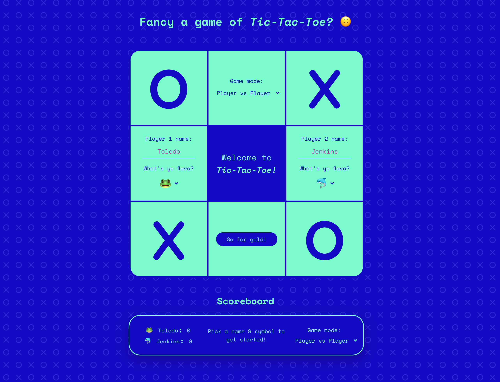
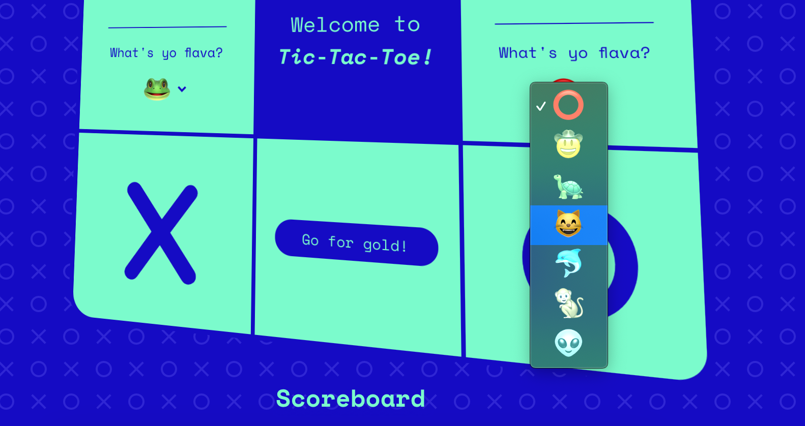
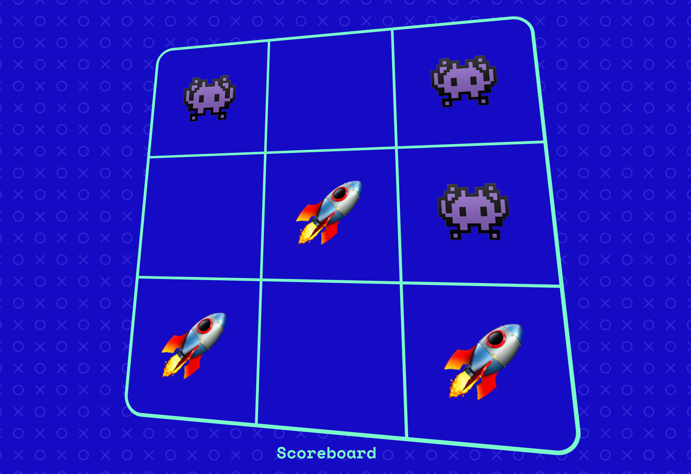
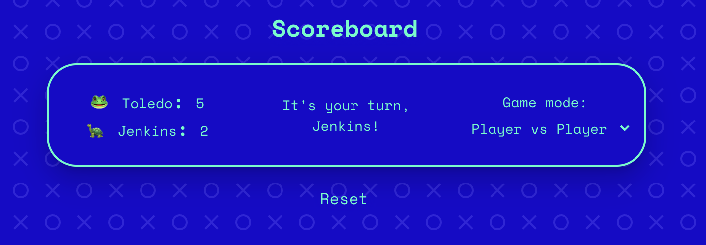

# _Tic-Tac-Toe_

## Welcome!

Yes, it's been done time and time again, though I hope you can enjoy my take on it!

Have a crack at it [here](https://oisa.github.io/tic-tac-toe/). 🤫

---

## Features

### Choose yo own symbol 🐒

Noughts and crosses can be boring, why not pick an emoji instead?

---

### Play either a fellow humanoid 😊 or lé c0mput3r 👾

Win all you can against the c0mput3r now because it will soon learn to outsmart you*. 🧠

---

### Local Storage 📥

Scores, names and symbols are stored locally so if you refresh the page accidentally, your info will still be there. Simply change game modes or click the 'Reset' button down the bottom to wipe this if you want to start afresh.

---

### Improvements/fixes in the pipeline 🛠

- [ ] Refactor the DRY CSS/JS bits. 🥵
- [ ] Safari shows some elements like customised drop downs and z-index a little funky - will work on resolving these in the next update. 🧭
- [ ] *Smarter c0mput3r player - add greater intelligence into the computer player. At the moment its choices are....well let's be honest, it's hard _not_ to win at the moment. Will fix this in the next update. 👾
- [ ] Mobile-responsiveness - this experience needs to be improved, pronto! 📱

Notice anything else that's out of whack? [Holla at me](mailto:j.m.o.carlton@gmail.com?subject=[GitHub]%20Tic-Tac-Toe%20Suggestion%20😎)!

### What's next? 💡

- Shuffle feature - forgot your name and can't pick a symbol? This will help! 🔀
- Play via keyboard - ability for players to use keys instead of the clicky mouse. 🐭
- Add ability for multi-player games between different browsers. 👩🏻‍💻👨🏻‍💻
- Show a shaded version of the current player's symbol on hovering available squares during game. 🕴🏻

### Credit & Shoutouts 🗣

Thanks _so_ much to [Joel](https://github.com/wofockham), [Stacey](https://github.com/StaceyBros) and [Guillaume](https://github.com/gcrk) and the rest of the GA team for the brilliant learning experience prior to and whilst attempting to build this app - it's been a wild time already and looking forward to what's to come in the course - thank you! 🤠

Shouts out to the frameworks that helped make it look speccy too:

- [Animate.css](https://animate.style/)
- [Tilt.js](https://gijsroge.github.io/tilt.js/)

Special mention also to [jQuery](https://github.com/jquery) which I've used in the build - some may _**react**_ a certain way to this 😂, though it certainly helped with speed of production and is the beginning of exploring building things with JS - it's been fun and I look forward to learning new frameworks that work similarly. 🖼

---

This has been fun and I hope you enjoy the result as much as I enjoyed the process! 😎
